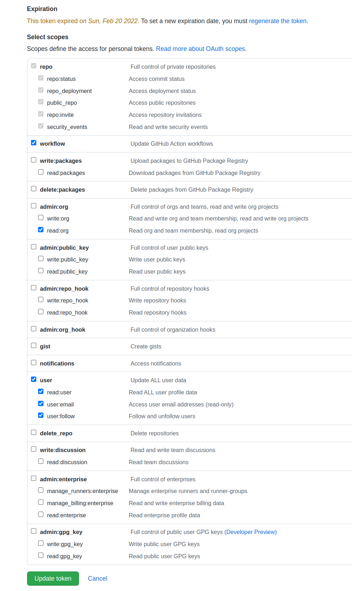

# PR Custom Review

This is a GitHub Action created for complex pull request approval scenarios which are not currently supported by GitHub's [Branch Protection Rules](https://docs.github.com/en/repositories/configuring-branches-and-merges-in-your-repository/defining-the-mergeability-of-pull-requests/about-protected-branches#about-branch-protection-rules). It might extend or even completely replace the [Require pull request reviews before merging](https://docs.github.com/en/repositories/configuring-branches-and-merges-in-your-repository/defining-the-mergeability-of-pull-requests/about-protected-branches#require-pull-request-reviews-before-merging) setting.

## TOC

- [How it works](#how-it-works)
  - [High level flow chart](#high-level-flow-chart)
- [Built-in checks](#built-in-checks)
- [Configuration](#configuration)
  - [Configuration file](#configuration-file)
  - [Rules syntax](#rules-syntax)
    - [Basic Rule syntax](#basic-rule-syntax)
    - [AND Rule syntax](#and-rule-syntax)
    - [OR Rule syntax](#or-rule-syntax)
  - [Workflow configuration](#workflow-configuration)
  - [GitHub repository configuration](#github-repository-configuration)
- [Development](#development)
  - [Build](#build)
    - [Build steps](#build-steps)
  - [Trial](#trial)
    - [Trial steps](#trial-steps)
  - [Release](#release)
    - [Release steps](#release-steps)
- [Deployment](#deployment)

## How it works <a name="how-it-works"></a>

Upon receiving [pull_request](https://docs.github.com/en/actions/learn-github-actions/events-that-trigger-workflows#pull_request) and [pull_request_review](https://docs.github.com/en/actions/learn-github-actions/events-that-trigger-workflows#pull_request_review) events (to be enabled via [workflow configuration](#workflow-configuration)), this action evaluates all rules described in the [configuration file](#action-configuration). Currently two types of rules are supported:

- `diff` which matches a rule based on the PR's diff content
- `changed_files` which matches a rule based on paths/files changed in the PR

If a given rule is matched and its approval count is not met, then reviews will be requested from the missing users/teams for that rule and a failed commit status will be set for the PR; this status should be made required through branch protection rules in order to block the PR from being merged until all conditions are passing (see [GitHub repository configuration](#github-repository-configuration)).

### High level flow chart


## Built-in checks <a name="built-in-checks"></a>

This action has the following non-configurable built-in checks:

- Lines which have a lock emoji (🔒) or any line directly below a lock emoji
  require:
  - 1 approval from [locks-review-team](#workflow-configuration)
  - 1 approval from [team-leads-team](#workflow-configuration)

- If the action's files are changed, 1 approval from
  [action-review-team](#workflow-configuration) is required
  - `.github/workflows/pr-custom-review.yml`
  - `.github/pr-custom-review.yml`

Customizable rules should be enabled through [configuration](#action-configuration).

## Configuration

### Configuration file <a name="configuration-file"></a>

The configuration file should be placed in `.github/pr-custom-review.yml`
(related to [built-in checks](#built-in-checks)).

The configuration file is always read from the repository's default branch. For
this reason it's recommended to commit the configuration file **before** the
action's workflow file is added, otherwise the action will fail with
`RequestError [HttpError]: Not Found` because the configuration does not yet
exist in the default branch.

### Rules syntax <a name="rules-syntax"></a>

Three kinds of rules are available:

- Basic Rule, through which you specify **top-level** `users` and `teams` for
  reaching `min_approvals`

- AND Rule, through which you specify subconditions of `users` and `teams`, each
  with its own `min_approvals`, and **all** of them (logical `AND`) should
  reach their respective `min_approvals`

- OR Rule, through which you specify subconditions of `users` and `teams`, each
  with its own `min_approvals`, and **any** of them (logical `OR`) should reach
  their respective `min_approvals`

It's not possible to mix fields from different rules kinds. For instance, it's
invalid to specify a **top-level** `min_approvals` for AND or OR rules: the
criteria should be put in the subconditions instead.

#### Basic Rule syntax <a name="basic-rule-syntax"></a>

```yaml
rules:
  - name: Rule name      # Used for the status check description. Keep it short
                         # as GitHub imposes a limit of 140 chars.

    check_type: diff     # Either "diff" or "changed_files".


    # Conditions take one of two forms: "include" or "include/exclude"
    # - Conditions' values are Javascript Regular Expressions used to match the
    #   either the diff (for check_type: diff) or changed files' paths (for
    #   check_type: changed_files)
    # - There is no need to include Javascript RegExp delimiters ('/') at the
    #   beginning or end of the regular expressions (those slashes are
    #   interpreted as literal slashes)
    # - "gm" modifiers will be added by the action

    # Condition: include form
    condition: .*

    # Condition: include/exclude form
    # The structure should be one of the following:
    # - Define "include" but not "exclude"
    # - Define "exclude" but not "include" (include defaults to ".*")
    # - Define both "include" and "exclude"
    # Note that excludes are computed *after* includes!
    # Example:
    # condition:
    #   include: ^foo      # Optional if exclude is provided
    #   exclude: ^foo/bar  # Optional if include is provided


    min_approvals: 2     # Minimum required approvals.
    users:
    # GitHub users which should be requested for reviews.
      - user1
      - user2
    teams:
    # GitHub teams which should be requested for reviews.
    # This refers to teams from the same organization as the repository where
    # this action is running.
    # Specify the teams only by name, without the organization part.
    # e.g. 'org/team1' will not work.
      - team1
      - team2
```

#### AND Rule syntax <a name="and-rule-syntax"></a>

AND Rules will only match if **all** subconditions listed in `all` are
fulfilled.

```yaml
rules:
  - name: Rule name
    condition: .*
    check_type: diff
    all:
      - min_approvals: 1
        users:
          - user1
      - min_approvals: 1
        users:
          - user2
        teams:
          - team1
```

Visit [Basic Rule syntax](#basic-rule-syntax) for the full explanation of each
field.

#### OR Rule syntax <a name="or-rule-syntax"></a>

OR Rules will match if **any** subconditions listed in `any` are fulfilled.

```yaml
rules:
  - name: Rule name
    condition: .*
    check_type: diff
    any:
      - min_approvals: 1
        users:
          - user1
      - min_approvals: 1
        users:
          - user2
        teams:
          - team1
```

Visit [Basic Rule syntax](#basic-rule-syntax) for the full explanation of each
field.

### Workflow configuration <a name="workflow-configuration"></a>

The workflow configuration should be placed in
`.github/workflows/pr-custom-review.yml` (related to
[built-in checks](#built-in-checks)).

```yaml
name: PR Custom Review Status    # The PR status will be created with this name.

on:                              # The events which will trigger the action.
  pull_request:                  # A "pull_request" event of selected types will trigger the action.
    branches:                    # Action will be triggered if a PR is made to following branches.
      - main
      - master
    types:                       # Types of "pull_request" event which will trigger the action.
      - opened                   # Default event - PR is created.
      - reopened                 # Default event - closed PR is reopened.
      - synchronize              # Default event - PR is changed.
      - review_request_removed   # Requested reviewer removed from PR. Action will re-request its review if it's required.
  pull_request_review:           # PR review received. Action will check whether PR meets required review rules.

jobs:
  build:
    runs-on: ubuntu-latest
    steps:
      - name: pr-custom-review
        uses: paritytech/pr-custom-review@tag           # Pick a release tag and put it after the "@".
        with:
          # The token needs the following scopes:
          # - `read:org` for being able to request reviews from teams
          # - `workflow` for being able to request the workflow's job
          #    information; used to track lines in the job's output
          token: ${{ secrets.REVIEWS_TOKEN }}

          # locks-review-team defines the team which will handle the "locks
          # touched" built-in rule. We recommend protecting this input with
          # "🔒" so that it won't be changed unless someone from
          # locks-review-team approves it.
          # 🔒 PROTECTED: Changes to locks-review-team should be approved by custom-locks-team
          locks-review-team: custom-locks-team

          # The second team which will handle the "locks touched" built-in rule.
          team-leads-team: my-custom-leads-team

          # The team which will handle the changes to the action's configuration.
          action-review-team: my-action-review-team
```

### GitHub repository configuration  <a name="github-repository-configuration"></a>

Although the action will work even without any additional [repository settings](https://docs.github.com/en/repositories/managing-your-repositorys-settings-and-features), for maximum enforcement effectiveness it is recommended to enable
[Branch Protection Rules](https://docs.github.com/en/repositories/configuring-branches-and-merges-in-your-repository/defining-the-mergeability-of-pull-requests/managing-a-branch-protection-rule) according to the screenshot below:


## Development

### Build

Build revolves around compiling the code and packaging it with
[ncc](https://github.com/vercel/ncc). Since the build output consists of plain
.js files, which can be executed directly by Node.js, it _could_ be ran
directly without packaging first; we regardless prefer to use `ncc` because it
bundles all the code (_including the dependencies' code_) into a single file
ahead-of-time, meaning the workflow can promptly run the action without having
to download dependencies first.

#### Build steps <a name="build-steps"></a>

1. Install the dependencies
    `npm install`
2. Build
    `npm run build`
3. Package
    `npm run package`

See the next sections for [trying it out](#trial) or [releasing](#release).

### Trial

A GitHub workflow will always clone the HEAD of
`${organization}/${repo}@${ref}` **when the action executes**, as exemplified
by the following line:

`uses: paritytech/pr-custom-review@branch`

Therefore any changes pushed to the branch will automatically be applied the
next time the action is ran.

#### Trial steps <a name="trial-steps"></a>

1. [Build](#build) the changes and push them to some branch
2. Change the workflow's step from `paritytech/pr-custom-review@branch` to your branch:

    ```diff
    -uses: paritytech/pr-custom-review@branch
    +uses: user/fork@branch
    ```

3. Re-run the action and note the changes were automatically applied

### Release

A GitHub workflow will always clone the HEAD of
`${organization}/${repo}@${tag}` **when the action executes**, as exemplified
by the following line:

`uses: paritytech/pr-custom-review@tag`

That behavior makes it viable to release by committing build artifacts directly
to a tag and then using the new tag in the repositories where this action is
installed.

#### Release steps <a name="release-steps"></a>

1. [Build](#build) the changes and push them to some tag
2. Use the new tag in your workflows:

    ```diff
    -uses: paritytech/pr-custom-review@1
    +uses: paritytech/pr-custom-review@2
    ```

## Deployment <a name="deployment"></a>

1. Create the teams to be used as inputs of the action

    The explanation for each team is available in
    [Workflow configuration](#workflow-configuration) and
    [action.yml](./action.yml).

    For public repositories all the used teams should be public,
    otherwise the action will not be able to request their review.

    The repository where the action is used should be added to the
    teams' repositories
    (`https://github.com/orgs/${ORG}/teams/${TEAM}/repositories`) with at least
    Read access, as per
    [Requesting a pull request review](https://docs.github.com/en/pull-requests/collaborating-with-pull-requests/proposing-changes-to-your-work-with-pull-requests/requesting-a-pull-request-review).

2. [Create a Personal Access Token](https://docs.github.com/en/authentication/keeping-your-account-and-data-secure/creating-a-personal-access-token)
  to be used as the `token` input of the action

    The rationale for each scope is described in
    [Workflow configuration](#workflow-configuration).

    

3. Set up the Personal Access Token as a workflow secret

    As of this writing, the secret setup can be done in
    `https://github.com/organizations/${ORG}/settings/secrets/actions`.
    For further context see
    [Creating encrypted secrets for an organization](https://docs.github.com/en/actions/security-guides/encrypted-secrets#creating-encrypted-secrets-for-an-organization)
    and
    [Using encrypted secrets in a workflow](https://docs.github.com/en/actions/security-guides/encrypted-secrets#using-encrypted-secrets-in-a-workflow).

4. Add the [configuration file](#configuration-file) to the repository's
  default branch, as demonstrated in
  <https://github.com/paritytech/substrate/pull/10968/files>.
  This should be done in a separate PR which should be merged before adding the
  workflow configuration in the next step.

5. Add the [workflow configuration](#workflow-configuration), as demonstrated in
  <https://github.com/paritytech/substrate/pull/10951/files>

    - Team inputs should use the teams created on Step 1
    - `token` input should use the Personal Access Token generated on Step 2

6. Trigger one of the events defined in the
  [workflow configuration](#workflow-configuration) or
  [run the workflow manually](https://docs.github.com/en/actions/managing-workflow-runs/manually-running-a-workflow)

7. Set the commit statuses' names generated from the triggered events to be
  required, as explained in the
  ["GitHub repository configuration" section](#github-repository-configuration)

### Testing

Run `npm run test`.

Test logging is saved to [snapshots](./test/batch) (`.snap` files). If your
code changes affect some snapshot then review the modifications and run `npm
run test -- -u`.
